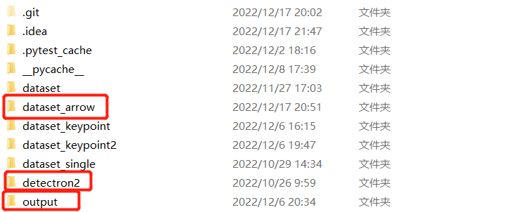

# FlowMind2Digital

Hệ thống AI tiên tiến để chuyển đổi hình ảnh flowchart thành các định dạng có thể chỉnh sửa được (PowerPoint và Draw.io).

## Tổng quan dự án

FlowMind2Digital là một công cụ AI mạnh mẽ sử dụng Detectron2 để nhận dạng và chuyển đổi các flowchart từ hình ảnh thành các file có thể chỉnh sửa. Dự án hỗ trợ hai format chính:

- **PPT Format** (.pptx): Tương thích với Microsoft PowerPoint
- **DrawIO Format** (.drawio): Tương thích với Draw.io và Diagrams.net

## Cấu trúc dự án

```
flowmind2digital/
├── ppt/                    # Phiên bản gốc cho PowerPoint
│   ├── data_preprocess.py
│   ├── predict.py
│   ├── generator.py
│   ├── train_keypoint.py
│   ├── fine_tuning.py
│   ├── requirements.txt    # Có xung đột paddleocr
│   └── units/
│       ├── geometry.py
│       └── nms.py
├── drawio/                 # Phiên bản mới cho Draw.io
│   ├── data_preprocess.py  # Xử lý định dạng .drawio
│   ├── predict.py          # Dự đoán cho định dạng .drawio
│   ├── generator.py        # Tạo file .drawio
│   ├── train_keypoint.py   # Huấn luyện với dữ liệu .drawio
│   ├── requirements.txt    # Không có xung đột
│   ├── README.md          # Hướng dẫn chi tiết
│   └── units/
│       ├── geometry.py
│       └── nms.py
├── visio/                  # Phiên bản cho Visio (hiện có)
├── weights/                # Model weights
├── fig/                    # Hình ảnh minh họa
└── README.md              # File này
```

## So sánh hai phiên bản

| Tính năng | PPT Version | DrawIO Version |
|-----------|-------------|----------------|
| **Format đầu ra** | .pptx | .drawio |
| **Tương thích** | Microsoft PowerPoint | Draw.io, Diagrams.net |
| **OCR Engine** | PaddleOCR | Tesseract/EasyOCR |
| **Xung đột thư viện** | Có (PaddlePaddle vs others) | Không |
| **Cài đặt** | Phức tạp | Đơn giản |
| **Khả năng chỉnh sửa** | Hạn chế | Cao |
| **Tích hợp web** | Không | Có (Draw.io online) |
| **Mở source** | Có | Có |

## Cài đặt nhanh

### Cho phiên bản Draw.io (Khuyến nghị)

```bash
cd drawio/
python -m venv venv
source venv/bin/activate  # Linux/Mac hoặc venv\Scripts\activate (Windows)
pip install torch torchvision
pip install detectron2 -f https://dl.fbaipublicfiles.com/detectron2/wheels/cu113/torch1.10/index.html
pip install -r requirements.txt
```

### Cho phiên bản PPT (Có xung đột)

```bash
cd ppt/
# Lưu ý: Có thể gặp xung đột với paddlepaddle và paddleocr
pip install -r requirements.txt
```

## Sử dụng

### Draw.io Version
```bash
cd drawio/
python generator.py
```

### PPT Version
```bash
cd ppt/
python generator.py
```

## Tính năng chính

### Nhận dạng hình dạng
- Hình chữ nhật (Process)
- Hình thoi (Decision)
- Hình tròn/oval (Start/End)
- Hình lục giác (Preparation)
- Hình bình hành (Input/Output)
- Mũi tên và đường kết nối

### Xử lý layout
- Tự động căn chỉnh
- Tối ưu hóa khoảng cách
- Nhóm các thành phần liên quan

### OCR và Text
- Nhận dạng văn bản trong hình
- Gắn text vào đúng hình dạng
- Hỗ trợ nhiều ngôn ngữ

## Vấn đề đã giải quyết

### Xung đột thư viện trong phiên bản PPT
Phiên bản gốc gặp xung đột giữa:
- `paddlepaddle` và `pytorch`
- `paddleocr` với các thư viện khác
- Các phiên bản conda packages không tương thích

### Giải pháp trong phiên bản Draw.io
- Loại bỏ dependency PaddleOCR
- Sử dụng Tesseract hoặc EasyOCR thay thế
- Cập nhật requirements.txt sạch sẽ
- Tương thích với môi trường hiện đại

## Huấn luyện mô hình

### Chuẩn bị dữ liệu
```bash
# Tạo cấu trúc dataset
mkdir -p dataset_drawio/{train,val}/{images,annotations}

# Chạy preprocessing
python preprocess.py
```

### Huấn luyện
```bash
python train_keypoint.py
```

### Fine-tuning
```bash
python fine_tuning.py
```

## Đánh giá và metrics

Sử dụng các file evaluation:
- `evaluation_class.py`: Đánh giá theo từng class
- `evaluation_total.py`: Đánh giá tổng thể
- `metrics.py`: Các metrics chi tiết

## Ví dụ kết quả

### Input


### Output
- File .drawio có thể mở trong Draw.io
- File .pptx có thể mở trong PowerPoint
- Giữ nguyên layout và kết nối

## Lộ trình phát triển

### Đã hoàn thành ✅
- Phiên bản PPT cơ bản
- Phiên bản Draw.io không xung đột
- Tài liệu chi tiết
- Evaluation metrics

### Đang phát triển 🚧
- Hỗ trợ nhiều loại diagram hơn
- Cải thiện độ chính xác OCR
- API REST service
- Web interface

### Kế hoạch 📋
- Hỗ trợ Mermaid format
- Tích hợp với cloud services
- Mobile app
- Real-time conversion

## Đóng góp

1. **Báo lỗi**: Tạo issue với mô tả chi tiết
2. **Đề xuất tính năng**: Thảo luận trong Discussions
3. **Code contribution**: Fork và tạo pull request
4. **Tài liệu**: Cải thiện README và documentation

## Giấy phép

MIT License - Xem [LICENSE](LICENSE) để biết chi tiết.

## Tác giả

- **Nguyên tác**: caijianfeng
- **Cải tiến Draw.io**: AI Assistant
- **Đóng góp**: Community

## Liên hệ

- **Issues**: [GitHub Issues](../../issues)
- **Discussions**: [GitHub Discussions](../../discussions)
- **Email**: Liên hệ qua GitHub

---

## Quick Start Guide

### Bước 1: Chọn phiên bản
```bash
# Khuyến nghị: Draw.io (không xung đột)
cd drawio/

# Hoặc: PPT (có thể xung đột)
cd ppt/
```

### Bước 2: Cài đặt
```bash
pip install -r requirements.txt
```

### Bước 3: Chạy
```bash
python generator.py
```

### Bước 4: Kiểm tra kết quả
- Draw.io: Mở file `result.drawio` trong Draw.io
- PPT: Mở file `result.pptx` trong PowerPoint

**Chúc bạn sử dụng thành công! 🎉**